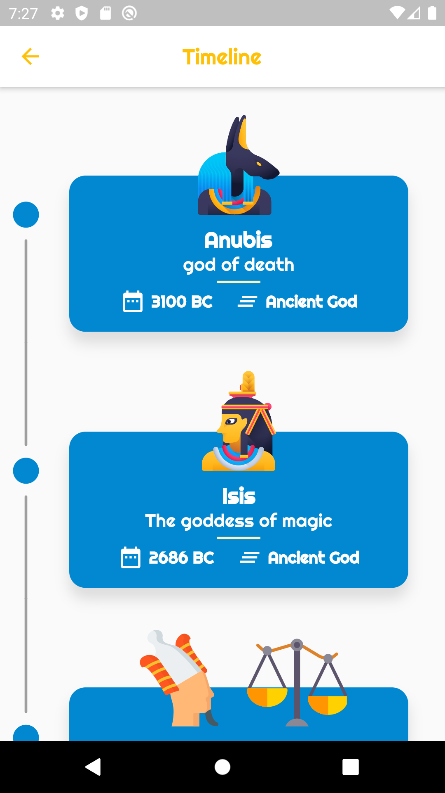
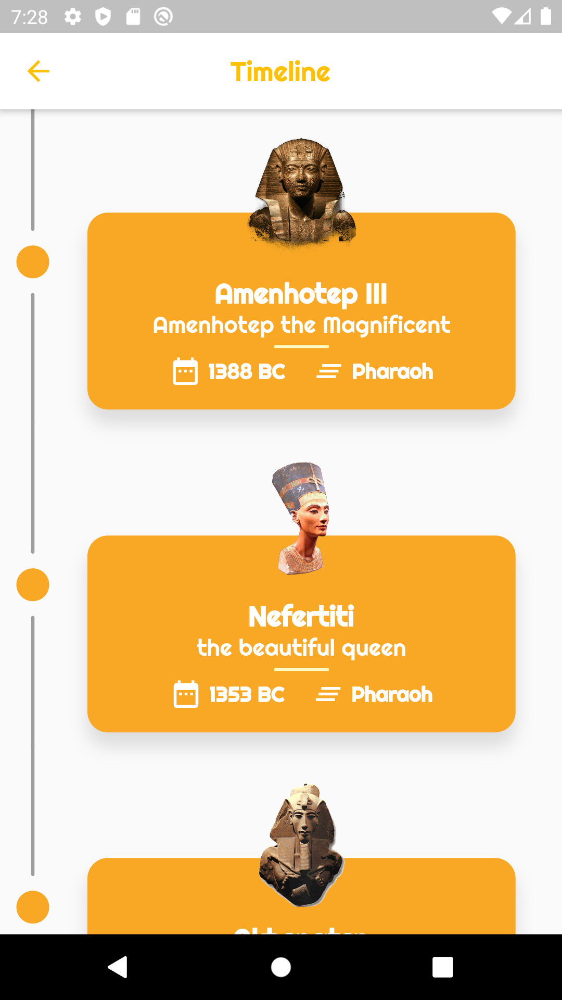
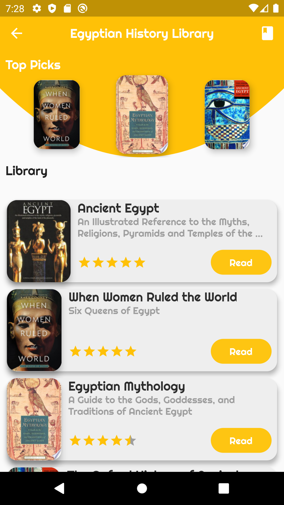
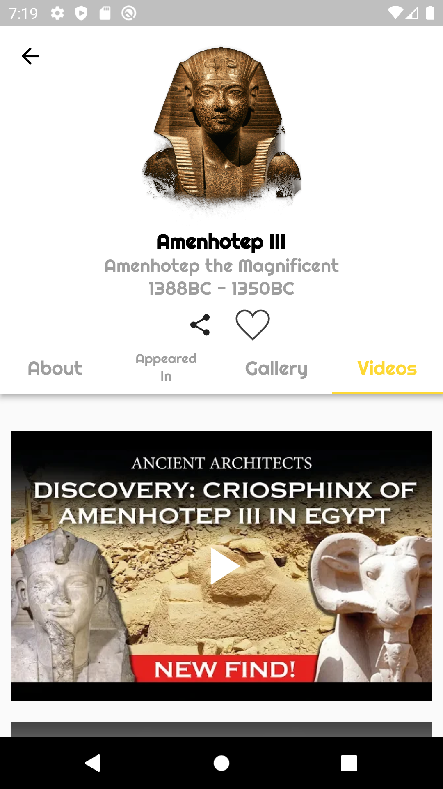
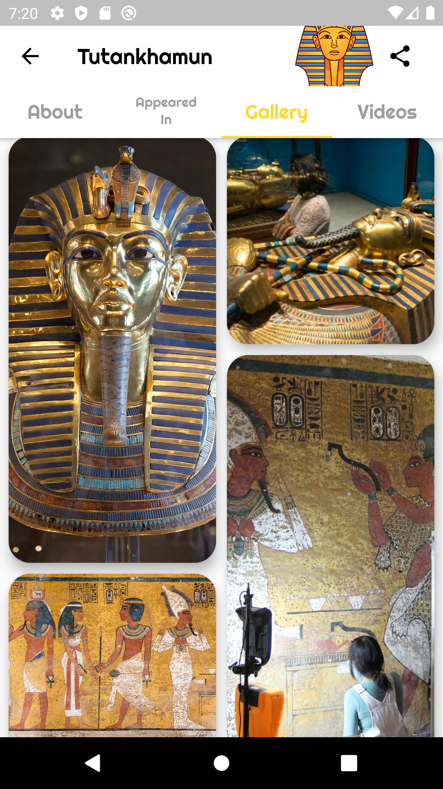

  
  <h3 align="center">Nile Gift</h3>
  

    Where it all begins
     
    Nile gift is a vertical timeline that allows you to navigate through ancient Egyptian characters (deity, pharaohs), learn more about them, their stories, images, and videos with fully animated and illustrated characters and also provide the ability to locate characters monuments and order uber to the monument directly
     
     
    <a href="https://github.com/Mohanedy98/Gift-of-The-Nile/issues/new">Report bug</a>
    ·
    <a href="https://github.com/Mohanedy98/Gift-of-The-Nile/issues/new">Request feature</a>
 

  

## Table of contents

- [Quick start](#quick-start)
- [Features](#features)
- [Screenshots](#screenshots)
- [Video](#video)
- [Development Environment](#development-environment)
- [Creator](#creator)
- [Copyright and license](#copyright-and-license)

## Quick start
**you can download the APK from Google Play [Nile Gift App](https://play.google.com/store/apps/details?id=com.mohanedy98.gift_of_the_nile)**

## Features
  |                      Features                      |
| :---------------------------------------------------- |
|Describe Ancient Egyptian history with different media types |
| Make it centralized, All you need to know about Egyptian ancient history and any ancient character in only one place you don’t have to search through many websites or different apps | 
| Make it easy for tourists to locate the monument of their  favorite characters just by one click users can know the distance and order any cap directly to the monument location|
| Offers a library specific for ancient Egyptian history with top-rated books|
| You can search through characters and share the story of your favorite characters |
| Completely Animated |

## Screenshots
  &nbsp; 
  &nbsp; 
  &nbsp; 

## Video
**SOON**

## Development Environment
* The App is developed using Bloc Pattern
* compatible with iOS & android
* Flutter 1.12.13
* Dart 2.7.0

## Creator
[**Mohaned Yossry**](https://github.com/Mohanedy98)

## Copyright and license

Code and documentation copyright 2020 the authors. Code released under the MIT License.

Enjoy
