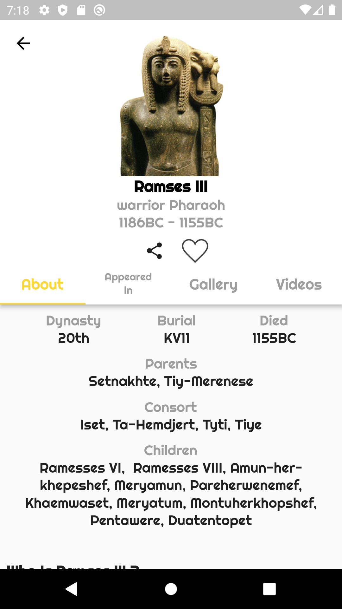

<p align="center">
    
</p>

  <h1 align="center">Nile Gift</h1>

<p align="center">
<a href="https://flutter.dev">
  
</a>
<a href="https://github.com/Mohanedy98/nile-gift/blob/main/LICENSE">

</a>
<a href="https://codecov.io/gh/Mohanedy98/nile-gift">

</a>
<a href="https://github.com/Mohanedy98/Gift-of-The-Nile">

</a>
<br>
    The Nile Gift Flutter app is a vertical timeline featuring ancient Egyptian characters such as deities and pharaohs. It offers the opportunity to explore their stories, images, and videos with fully animated and illustrated characters.
    <br>
    <a href="https://github.com/Mohanedy98/Gift-of-The-Nile/issues/new">Report bug</a>
    ·
    <a href="https://github.com/Mohanedy98/Gift-of-The-Nile/issues/new">Request feature</a>
<br>
</p>


<!-- TOC -->

* [Quick start](#quick-start)
* [Project Structure](#project-structure)
    * [Folder Structure](#folder-structure)
* [Tools Used](#tools-used)
* [Screenshots](#screenshots)
* [Development Environment](#development-environment)
* [Creator](#creator)

<!-- TOC -->

## Quick start

To run this project, you need to have Flutter installed on your machine. You can follow the
[official documentation](https://flutter.dev/docs/get-started/install) to install Flutter

- After installing Flutter, you can clone this repository and navigate to the project folder:

```shell
git clone https://github.com/Mohanedy98/Gift-of-The-Nile.git
cd Gift-of-The-Nile
```

- Then, you can run the following commands to get the dependencies and launch the app:

```shell
flutter pub get
flutter run
```

You can also use an IDE like Visual Studio Code or Android Studio to open and run the project.

## Project Structure

This project uses Clean Architecture and is separated into four main layers:

* **Data**: Holds the data access layer, which contains the repositories responsible for abstracting
  the data source used. In this case, the data source is a REST API, but it could be anything else,
  like a REST API, database, or cache.
* **Domain**: Holds the business logic layer, which contains the use cases responsible for handling
  the business logic of the application and the abstract repositories. The use cases are the entry
  point to the domain layer.
* **Presentation**: Holds the presentation layer, which contains the UI responsible for presenting
  the data to the user and handling user interactions. It also contains the blocs, which are
  responsible for preparing the data to be presented and for handling the interactions between the
  view and the use cases.
* **Core**: Holds the core layer, which contains the common code between the other layers, like
  enums and the dependency injection.

### Folder Structure

```markdown
📦lib
┣ 📂core
┃ ┣ 📂constants
┃ ┣ 📂di
┃ ┗ 📂enums
┣ 📂data
┃ ┣ 📂constants
┃ ┣ 📂datasources
┃ ┣ 📂models
┃ ┣ 📂repositories
┃ ┗ 📜index.dart
┣ 📂domain
┃ ┣ 📂entities
┃ ┣ 📂repositories
┃ ┣ 📂usecases
┃ ┗ 📜index.dart
┣ 📂presentation
┃ ┣ 📂base
┃ ┣ 📂components
┃ ┣ 📂pages
┃ ┃ ┣ 📂home => each page has its own bloc and widgets.
┃ ┃ ┃ ┣ 📂bloc
┃ ┃ ┃ ┣ 📂widgets
┃ ┃ ┃ ┣ 📜home_page.dart => The page contains only the scaffold and the bloc provider.
┃ ┃ ┃ ┗ 📜index.dart
┃ ┣ 📂utils
┃ ┃ ┗ 📂extensions => UI Specific Extensions.
┃ ┗ 📜index.dart
┗ 📜main.dart => The app entry point.
```

## Tools Used

| Tool                                                                                         | Used for             |
|----------------------------------------------------------------------------------------------|----------------------|
| [Bloc](https://pub.dev/packages/bloc)                                                        | State management     |
| [GetIt](https://pub.dev/packages/get_it) + [Injectable](https://pub.dev/packages/injectable) | Dependency Injection |
| [Hive](https://pub.dev/packages/hive_flutter)                                                | Data Storage         |
| [CachedNetworkImage](https://pub.dev/packages/cached_network_image)                          | Image Caching        |
| [Lint](https://pub.dev/packages/lint)                                                        | Lint rules           |

## Screenshots

  &nbsp; 
  &nbsp; 
  &nbsp; 

## Development Environment

* Compatible with iOS & android
* Flutter 3.10.5
* Dart 3.0.0

## License

This project is licensed under the MIT License - see the [LICENSE](LICENSE) file for details

